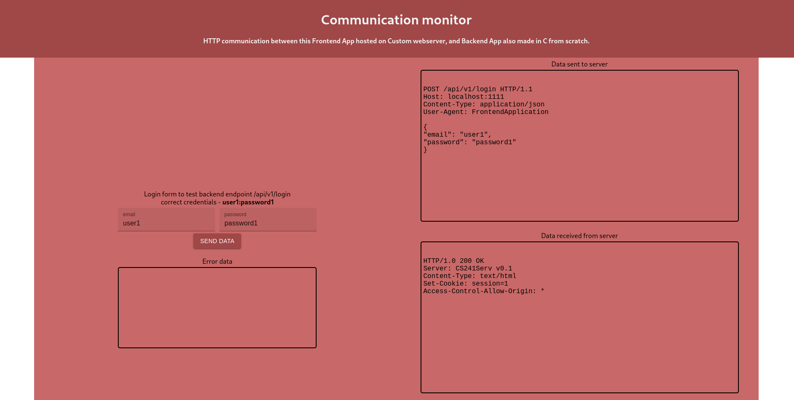

# Web server, and web application written in C from scratch.

### Description
This is a simple web server written in C. It is able to serve static files and dynamic content. The dynamic content is generated by a web application also written in C. Both server and application are written from scratch.

### How to use
1. Clone the repository
2. Compile webserver.c and replace the executable in the webserver directory with your new compiled executable.
You can compile the webserver.c file with the following command: `gcc webserver.c -o webserver`
3. Compile main.c from WebApplicationBackend and replace the executable, you can do this same as in point 2
4. Open browser at localhost:1234, and enjoy the web application:)

### Application View
Frontend, reactJS based app allows us to log into the backend written in C, and shows us the http requests and responses.

### Resources
I helped myself with following repository from AaronKalair:
https://github.com/AaronKalair/C-Web-Server
big thanks to him for sharing his code.

